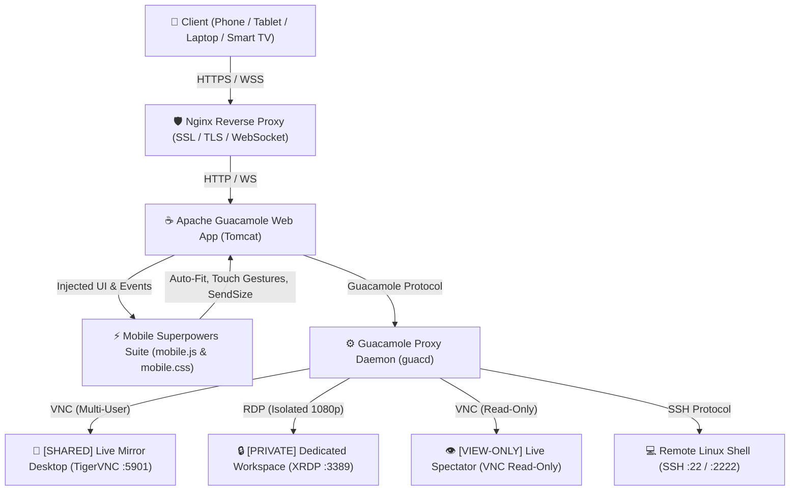

# ⚡ Apache Guacamole Mobile Superpowers Suite

> **Turn Apache Guacamole into a world-class mobile workstation: Responsive Full-Screen Auto-Fit, Native Mobile Touch, Smooth Relative Trackpad, Two-Finger Trackpad Page Scrolling, Google Maps-Style 2-Finger Pan & Zoom, Zero-Drift Terminal Docking, Cross-Browser Fullscreen, and Strict Zero-Interruption Keyboard Policy.**

[](LICENSE)
[](https://guacamole.apache.org/)
[]()
[]()
[]()

---

## 📌 Executive Summary & Motivation

Running a **Linux Desktop in the Cloud** directly from a web browser gives engineers, researchers, and remote teams boundless compute power from anywhere. [Apache Guacamole](https://guacamole.apache.org/) is the industry-standard, clientless remote gateway for RDP, VNC, and SSH.

However, standard out-of-the-box Guacamole was architected primarily for physical desktop mice and 101-key keyboards. When opened on mobile devices (Android, iPhone, iPad), laptops, or Smart TV browsers, users face critical friction:

- ❌ **Hardcoded Scaling & Small Initial Screen**: Fixed scale factors shrink 1080p remote desktops into tiny floating boxes on Smart TVs, tablets, or laptops until manually zoomed in.
- ❌ **Terminal Window Drifting**: Panning or pinching in a terminal session can cause the entire terminal canvas to slide out of the window into empty black void.
- ❌ **Broken Fullscreen Toggle**: Clicking "Exit Fullscreen" on laptop Chrome often throws unhandled Promise rejections or fails when browser-level F11 fullscreen is active.
- ❌ **Missing Page Scrolling**: Scrolling web pages (Firefox/Chrome) or long documents on remote desktops was impossible without clumsily grabbing scrollbars.
- ❌ **Intrusive Keyboard Auto-Popups**: Merely scrolling through a shell buffer or tapping the screen accidentally summons the virtual keyboard, obstructing the terminal view.
- ❌ **Clunky On-Screen Keyboards**: Guacamole attempts to render a rigid simulated HTML canvas keyboard (`<guac-osk>`) instead of letting users leverage their phone's native Gboard, Apple iOS, or Samsung keyboard with autocorrect and voice typing.

**Apache Guacamole Mobile Superpowers Suite** is a zero-latency, drop-in extension that completely transforms Guacamole into a native-feeling, high-performance workstation across phones, tablets, laptops, and Smart TVs.

---

## 🌟 Key Features & Architectural Superpowers

```
  ┌────────────────────────────────────────────────────────────────────────┐
  │              ⚡ APACHE GUACAMOLE MOBILE WORKSPACE SUITE                │
  ├────────────────────────────────────────────────────────────────────────┤
  │  🖥️  Responsive Auto-Fit (Opens at Biggest Screen Size on All Devices)  │
  │  📜  Two-Finger Trackpad Page Scroll (Scroll Webpages & Docs Smoothly) │
  │  🗺️  Google Maps 2-Finger Pan & Zoom (Smooth Scaling up to 500%)       │
  │  💻  Zero-Drift Terminal Docking (Never Moves or Slides Out of Window) │
  │  ⛶   Universal Fullscreen & Clean Exit (Full Laptop Chrome Support)    │
  │  👥  Multi-User Real-Time Collaboration & Live Spectator Modes         │
  │  ⏻   Compact Vector SVG PowerIcon Pill (Draggable Anywhere on Screen)  │
  │  ⌨️  Strict Isolated Keyboard Toggle (Zero Auto-Popups on Scroll)      │
  │  🖱️  Full-Screen Relative Trackpad Mode (Fluid Cursor Gliding)         │
  │  📋  Standard 1.8s Long-Press Copy & Instant Paste                    │
  └────────────────────────────────────────────────────────────────────────┘
```

### 1. 🖥️ Dynamic Responsive Auto-Fit (Biggest Screen on Load)
- **Eliminated Hardcoded Scale**: Replaced legacy static `0.28` (28%) scale with a dynamic mathematical viewport calculator.
- **Immediate Maximum Screen Fill**: On **Smart TV browsers, laptops, desktop monitors, and phones**, the remote desktop automatically opens at the **largest possible size filling your viewport edge-to-edge** without black borders or cropping.
- **Full HD 1080p Standard**: The remote desktop renders at native **1920x1080 Full HD**. If icons or fonts feel small on high-DPI screens, users can smoothly zoom into any section.
- **Bounded Zoom-Out**: When zooming back out, the display gracefully stops at full screen fit so it never collapses into a small thumbnail.

### 2. 💻 Zero-Drift Terminal Docking & Output Buffer Scroll
- **Never Moves Out of Window**: Terminal sessions (SSH) strictly lock `scrollLeft = 0` and `scrollTop = 0`. The terminal canvas is pinned flush at `(0, 0)` edge-to-edge and **never drifts, translates, or slides off-screen**.
- **1-Finger Smooth Buffer Scroll**: Single-finger swipes inside the terminal scroll the **shell text output history**, never shifting the viewport canvas.
- **Dynamic Character Reflow (`SIGWINCH`)**: When zooming, the extension calculates effective terminal columns and triggers Guacamole's PTY resize (`client.sendSize()`), reflowing text dynamically across the screen.

### 3. ⛶ Universal Fullscreen & Laptop Chrome Fix
- **Safe Promise Handling**: Wrapped `requestFullscreen()` and `exitFullscreen()` in cross-browser invocations (`.call(document)`) with Promise rejection guards.
- **Hardware / F11 Fullscreen Awareness**: Accurately detects whether fullscreen was triggered via HTML5 DOM or browser-level <kbd>F11</kbd> / Mac green button, displaying helpful on-screen guidance when browser security requires a keypress.
- **Persistent State Sync**: Synchronizes button labels (`[ ⛶ Full Screen ]` ↔ `[ ✕ Exit Full ]`) across all browser resize and orientation change events.

### 4. 📜 Two-Finger Trackpad Page Scroll
- **Laptop-Style Page Navigation**: Swiping two fingers in parallel immediately scrolls the active window, browser page (Firefox, Chrome), PDF document, or editor under your fingers.
- **Intelligent Gesture Classifier**: Automatically distinguishes between two-finger parallel swiping (Page Scroll) and pinching/spreading (Zoom). No manual mode toggling required.

### 5. 🗺️ Google Maps-Style 2D Pan & Glide Zoom
- **Midpoint-Anchored Gestures**: Zooming and panning operate identically to Google Maps or Apple Maps, anchored to the focal point between your two fingers.
- **Laptop Trackpad & Mouse Wheel Zoom**: Hold <kbd>Ctrl</kbd> + **Mouse Wheel** or pinch on laptop trackpads to smoothly zoom in on fine text or detail up to **500%**.
- **`[ 📐 Fit ]` Instant Reset**: Tapping `[ 📐 Fit ]` snaps the display back to 100% full screen fit.

### 6. 👥 Multi-User Real-Time Collaboration & Live Spectator Modes
- **`[SHARED]` Live Mirror (VNC)**: Multiple users can connect to the same desktop session simultaneously without kicking each other off, collaborating in real-time.
- **`[PRIVATE]` Dedicated Workspace (RDP)**: Individual, isolated high-performance desktop with local audio pass-through and cloud drive redirection.
- **`[VIEW-ONLY]` Live Spectator**: Read-only monitoring connection where guests or students can watch the screen live in real-time without mouse or keyboard interference.

### 7. ⌨️ Strict Terminal Keyboard Policy
- **Zero Auto-Popups**: The on-screen mobile keyboard will **NEVER** pop up when scrolling with one finger, swiping, or navigating the terminal buffer.
- **Dedicated `[ ⌨️ Keyboard ]` Toggle**: Located at the front of the terminal helper bar.
- **Visual Viewport Adaptive Elevation**: When the virtual keyboard appears, the helper bar automatically shifts up with **`+16px` clearance** above the keys. Tap `[ ✕ ⌨️ ]` or tap the button again to dismiss.

### 8. ⏻ Compact Vector SVG PowerIcon Capsule
- **Crisp Inline SVG Vector**: 100% sharp rendering across all displays without missing glyphs.
- **Ultra-Compact 26px Profile**: Unobtrusive floating capsule positioned neatly in the top corner.
- **Freeform Drag Anywhere**: Touch and drag the capsule anywhere on screen. Movement tracking suppresses accidental tap expansion.

---

## 🏗️ Architecture & Interaction Flow



---

## 🚀 Quick Start / Installation

You can install this suite either as a **drop-in extension JAR** on an existing Guacamole server, or deploy a **complete Docker stack** from scratch.

### Option 1: Drop-in Extension into Existing Guacamole (2 Minutes)

1. **Clone the Repository & Build the Extension JAR**:
   ```bash
   git clone https://github.com/adminsir-glich/guacamole-mobile-suite.git
   cd guacamole-mobile-suite/extension
   chmod +x build.sh && ./build.sh
   ```
   This generates `guacamole-mobile-suite.jar`.

2. **Deploy to your Guacamole Extensions Directory**:
   ```bash
   # If running via Docker:
   cp guacamole-mobile-suite.jar /path/to/guacamole/config/extensions/
   docker restart guacamole

   # If running on bare-metal Tomcat (Ubuntu / Debian):
   sudo cp guacamole-mobile-suite.jar /etc/guacamole/extensions/
   sudo systemctl restart tomcat9
   ```

3. **Verify Deployment**:
   Open Guacamole in your browser. The remote desktop will immediately open filling the entire screen, with the **PowerIcon control capsule** (`[ ⏻ Guac ✥ ]`) accessible in the top-right corner.

---

### Option 2: Complete Docker Compose Deployment

```bash
cd guacamole-mobile-suite/docker

# 1. Create extensions folder and place the built jar
mkdir -p extensions
cp ../guacamole-mobile-suite.jar extensions/

# 2. Copy the sample user-mapping configuration
cp user-mapping.xml.example user-mapping.xml
# Edit user-mapping.xml with your credentials and server IP
nano user-mapping.xml

# 3. Launch the stack
docker compose up -d
```

Your Guacamole instance is now running on `http://127.0.0.1:8080/guacamole/`.

---

## ⚙️ Configuration Reference (`user-mapping.xml`)

```xml
<user-mapping>
    <authorize username="your_user" password="YourStrongPassword123!">

        <!-- 1. [SHARED] Live Mirror & Collaborative Workspace (VNC) -->
        <!-- Multiple users can connect to this same port simultaneously without disconnecting each other -->
        <connection name="[SHARED] Ubuntu Desktop (Live Mirror - Collaborate)">
            <protocol>vnc</protocol>
            <param name="hostname">172.17.0.1</param>
            <param name="port">5901</param>
            <param name="password">VncDesktopPassword123!</param>
            <param name="color-depth">24</param>
            <param name="autoretry">3</param>
            <param name="enable-audio">true</param>
        </connection>

        <!-- 2. [PRIVATE] High-Performance Dedicated Workspace (RDP) -->
        <!-- Locked to native Full HD (1920x1080) for highest crisp resolution -->
        <connection name="[PRIVATE] Ubuntu Desktop (Dedicated 1080p Workspace)">
            <protocol>rdp</protocol>
            <param name="hostname">172.17.0.1</param>
            <param name="port">3389</param>
            <param name="username">your_user</param>
            <param name="password">YourStrongPassword123!</param>
            <param name="security">any</param>
            <param name="ignore-cert">true</param>
            <param name="width">1920</param>
            <param name="height">1080</param>
            <param name="dpi">96</param>
            <param name="color-depth">32</param>
            <param name="enable-font-smoothing">true</param>
            <param name="enable-audio">true</param>
            <param name="enable-audio-input">true</param>
            <param name="enable-drive">true</param>
            <param name="drive-path">/tmp/guac-drive</param>
            <param name="drive-name">CloudDrive</param>
            <param name="create-drive-path">true</param>
        </connection>

        <!-- 3. [VIEW-ONLY] Live Spectator Workspace (VNC Read-Only) -->
        <!-- Watch the remote desktop in real-time without mouse or keyboard interference -->
        <connection name="[VIEW-ONLY] Ubuntu Desktop (Live Spectator)">
            <protocol>vnc</protocol>
            <param name="hostname">172.17.0.1</param>
            <param name="port">5901</param>
            <param name="password">VncDesktopPassword123!</param>
            <param name="read-only">true</param>
            <param name="color-depth">24</param>
        </connection>

        <!-- 4. Supercharged SSH Terminal (Enhanced for Mobile with 10k Scrollback) -->
        <connection name="Linux Cloud Terminal (SSH)">
            <protocol>ssh</protocol>
            <param name="hostname">172.17.0.1</param>
            <param name="port">2222</param>
            <param name="username">your_user</param>
            <param name="password">YourStrongPassword123!</param>
            <param name="font-name">monospace</param>
            <param name="font-size">14</param>
            <param name="scrollback">10000</param>
            <param name="server-alive-interval">15</param>
            <param name="color-scheme">gray-black</param>
        </connection>

    </authorize>
</user-mapping>
```

> **Important Hostname Tip:** When `guacd` runs inside a Docker container and connects to services on the host machine, use the Docker bridge gateway IP (typically `172.17.0.1` or `172.26.0.1`), **not** `127.0.0.1` (which would point inside the container itself).

---

## 🛠️ Production Deployment & Troubleshooting (10 Pro-Tips)

When deploying Guacamole with remote desktops and mobile extensions in production, keep these battle-tested practices in mind:

| # | Topic | Best Practice & Troubleshooting |
|---|---|---|
| **1** | **Docker Host Gateway** | Inside Docker, `127.0.0.1` is the container itself. Use the Docker bridge gateway (`172.x.x.1`) in `user-mapping.xml` to reach host RDP/VNC/SSH services. |
| **2** | **Host Firewall (UFW)** | Allow the Docker subnet to access host services without exposing RDP/VNC to the public internet: <br>`sudo ufw allow from 172.16.0.0/12 comment "Docker internal network"` |
| **3** | **XRDP TLS Security** | If XRDP returns `wrong security type`, configure `security_layer=negotiate` in `/etc/xrdp/xrdp.ini` and add the `xrdp` system user to the `ssl-cert` group: <br>`sudo adduser xrdp ssl-cert && sudo systemctl restart xrdp` |
| **4** | **TigerVNC Localhost Flag** | By default, TigerVNC may bind to `127.0.0.1` only. Start TigerVNC with `-localhost no` or set `localhost=0` in `~/.config/tigervnc/config` so `guacd` on the Docker bridge can reach it. |
| **5** | **VNC Persistent Service** | Create a systemd unit (`/etc/systemd/system/vncserver-home.service`) with `ExecStart=/usr/bin/vncserver :1 -geometry 1920x1080 -depth 24 -localhost no` so VNC survives server reboots. |
| **6** | **Fixed Full HD Resolution** | Specify `<param name="width">1920</param>` and `<param name="height">1080</param>` with `resize-method=none` for RDP so the server renders a crisp, stable 1080p canvas that scales smoothly. |
| **7** | **Custom SSH Ports** | Cloud servers often run SSH on custom ports (e.g. `2222`). Always specify the exact port in `<param name="port">2222</param>`. |
| **8** | **Multi-User Collaboration** | Use VNC for shared live mirrors (multiple users see the same screen concurrently) and RDP for isolated private workspaces. |
| **9** | **Brute-Force Protection** | The bundled `guacamole-auth-ban.jar` automatically locks an IP for 300 seconds after 5 failed authentication attempts. |
| **10** | **Nginx WebSocket Buffering** | Always set `proxy_buffering off;` and forward WebSocket upgrade headers (`Upgrade $http_upgrade`, `Connection "upgrade"`) in your Nginx reverse proxy configuration. |

---

## 📱 Gestures & Shortcuts Cheat Sheet

| Feature / Action | Input / Gesture | Description |
| :--- | :--- | :--- |
| **Auto-Fit Screen** | Automatic on load / `[ 📐 Fit ]` | Immediately opens at biggest screen size filling viewport; snaps back on tap |
| **Trackpad Page Scroll** | 2-finger swipe up / down | Smoothly scrolls web pages, PDFs, documents, and terminals under your fingers |
| **Google Maps Pan & Zoom** | 2-finger pinch & glide | Omnidirectional 2D glide across remote instance; scales from fit up to 500% |
| **Laptop Zoom In / Out** | <kbd>Ctrl</kbd> + Mouse Wheel / Trackpad Pinch | Smoothly zooms in on small text or fine details |
| **Terminal Buffer Scroll** | 1-finger swipe up / down | Smooth terminal scrolling without auto-summoning keyboard |
| **Summon Native Keyboard** | Tap `[ ⌨️ Keyboard ]` | Summons Gboard / Samsung / iOS keyboard; safe +16px helper bar clearance |
| **Dismiss Keyboard** | Tap `[ ✕ ⌨️ ]` or keyboard toggle | Instantly hides keyboard and restores helper bar flush to the bottom |
| **Move PowerIcon Capsule** | Touch & drag minimized pill | Fluid repositioning anywhere on the screen without accidental expansion |
| **Expand PowerIcon Capsule** | Tap minimized capsule once | Opens the full Dynamic Island floating control center |
| **1:1 Resolution Zoom** | Tap `[ 1:1 ]` | Snaps scale to 100% full pixel resolution (1920x1080) |
| **Relative Trackpad Toggle** | Tap `[ 🖱️ Trackpad ]` / `[ 👆 Direct ]` | Switch between laptop-style relative cursor navigation and direct touch |
| **Copy Selected Text** | Long-press (> 1.8s) or `[ 📋 Copy ]` | Copies active selection with haptic feedback |
| **Paste into Terminal** | Tap `[ 📋 Paste ]` | Injects system clipboard directly into the remote session |
| **Instant Home Return** | Tap `[ 🏠 Home ]` | Exits active session, leaves fullscreen, and returns to Guacamole home menu |
| **Toggle Fullscreen** | Tap `[ ⛶ Full Screen ]` / `[ ✕ Exit Full ]` | Hides browser address bar for maximum display area |

---

## 📄 License & Community

This project is licensed under the [MIT License](LICENSE). Pull requests, issue reports, and feature suggestions are warmly welcomed!

- **GitHub Repository**: [adminsir-glich/guacamole-mobile-suite](https://github.com/adminsir-glich/guacamole-mobile-suite)
- **Author**: Malik Musab ([themalikmusab.me](https://themalikmusab.me))
