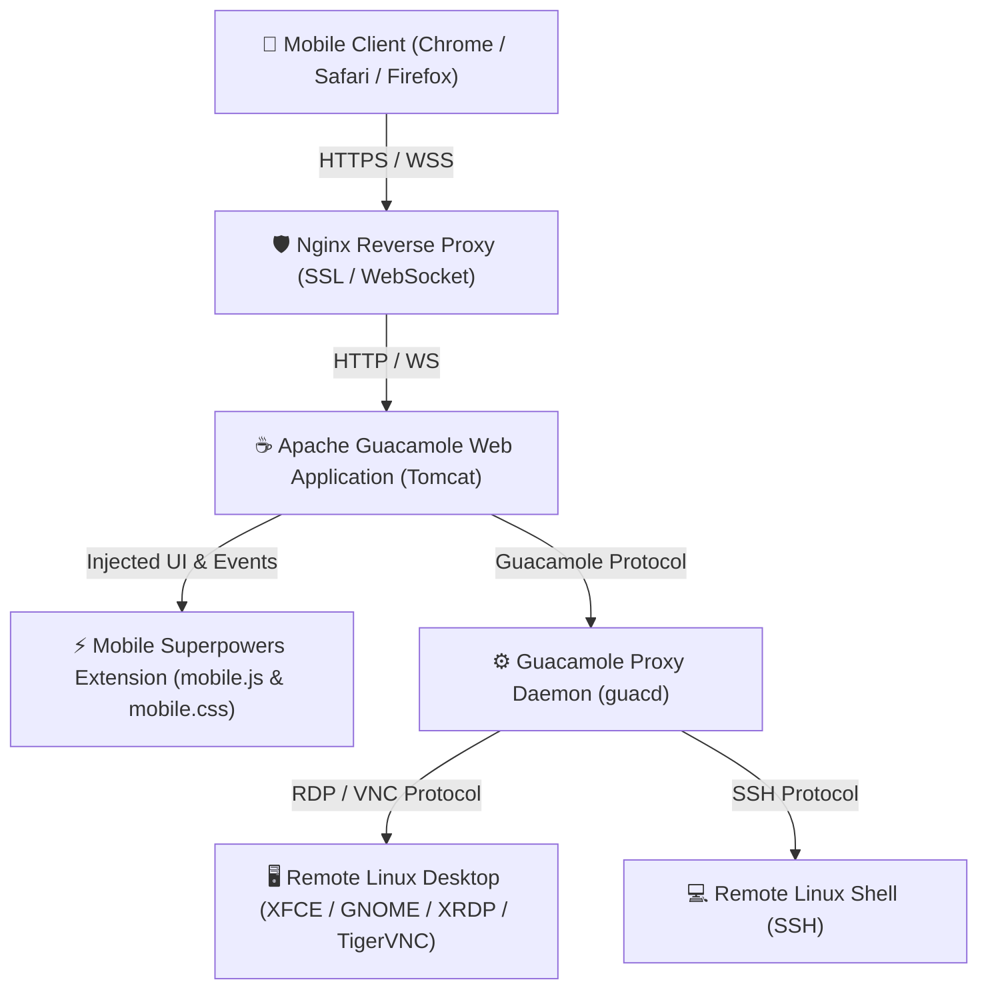
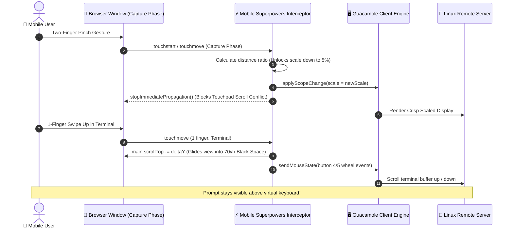

# 🚀 Apache Guacamole Mobile Superpowers Suite

> **Run a Full Linux Desktop in Any Browser with Native Mobile Touch, Smooth Trackpad, Fluid Pinch-to-Zoom, and Terminal Overscroll.**

[](LICENSE)
[](https://guacamole.apache.org/)
[]()
[]()

---

## 📌 Overview

**Apache Guacamole Mobile Superpowers Suite** is a client-side extension that transforms [Apache Guacamole](https://guacamole.apache.org/) into a touch-optimized, mobile-first cloud desktop and terminal gateway.

Running a **Desktop in Linux** via a web browser is one of the most powerful ways to access high-performance computing, remote workspaces, and development environments from anywhere. However, standard Apache Guacamole is designed primarily for desktop mouse and physical keyboard environments. When accessed from a mobile phone or tablet, default Guacamole suffers from critical usability bottlenecks:

- ❌ **Crushed Screen Resolution**: Desktops are forcefully shrunk down (`autoFit: true`) to a tiny ~38% stamp with no way to freely zoom out smaller or pan smoothly.
- ❌ **Clunky On-Screen Keyboards**: Guacamole attempts to draw a simulated `<guac-osk>` keyboard instead of summoning the phone's native keyboard (Gboard, Samsung, or iOS).
- ❌ **Terminal Prompt Cut-Off**: When typing in a terminal, the mobile virtual keyboard covers the prompt at the bottom of the screen, and the terminal refuses to scroll past the active row.
- ❌ **Frustrating Touch Navigation**: Direct touch on high-DPI remote desktops leads to misclicks and difficulty dragging windows.
- ❌ **Missing Native Fullscreen Controls**: Mobile browser address bars and navigation tabs consume valuable screen real estate.

**This suite resolves every single mobile pain point**, delivering an experience comparable to native mobile apps like Termius, Jump Desktop, and Termux directly inside your web browser.

---

## ✨ Features & Mobile Superpowers

### 1. 🗺️ Google Maps-Style 2-Finger Omnidirectional Pan & Glide Zoom
- **Simultaneous 2D Glide & Zoom**: Just like Google Maps, pinch-zooming is anchored to the midpoint between your two fingers and allows simultaneous fluid gliding/panning in **all directions (X and Y)** across the entire remote desktop.
- **Reach Any Part of the Instance**: Effortlessly navigate across multi-monitor setups, wide IDEs, or large browser windows without getting locked into a single axis.
- **Bypasses 38% Lock**: Freely zoom down to **`5%`** or up to **`500%`**, with dedicated **`[ 📐 Fit ]`** and **`[ 1:1 ]`** buttons for instant snap-to-fit.

### 2. 💻 Edge-to-Edge Terminal with Dynamic PTY Character Reflow
- **No Floating Windows**: Completely eliminates table-cell centering and padding hacks that made the terminal look like a small window in a black void. The terminal occupies **100% of the screen width and height**.
- **Dynamic Character Reflow (`SIGWINCH`)**: When zooming in or out, the extension calculates effective terminal dimensions and triggers Guacamole's PTY resize (`client.sendSize()`). Real Linux shells (bash, zsh, tmux) reflow text columns dynamically across the full width, exactly like native mobile emulators (Termux, JuiceSSH).
- **1-Finger Smooth Buffer Scroll**: Effortlessly swipe vertically to scroll through your command history and output buffer without triggering unwanted viewport shifts.

### 3. ⌨️ Strict Keyboard Policy & Dedicated Bar Toggle Button
- **Zero Unwanted Keyboard Popups**: Under **NO** circumstance does the native mobile keyboard auto-summon on terminal touch, tap, scroll, or page load.
- **Persistent Mobile Terminal Bar**: In terminal sessions, the bottom shortcut bar is always visible and features a prominent `[ ⌨️ Keyboard ]` button at the front.
- **Explicit 1-Tap Toggle**: Tap `[ ⌨️ Keyboard ]` to summon your native keyboard (Gboard, Samsung, iOS); tap again or tap `[ ✕ ⌨️ ]` to dismiss.

### 4. ✥ Dedicated Move Handle & Minimized Dynamic Island
- **Dedicated `[ ✥ Move ]` Handle**: A distinct move button beside the pill controls allows immediate touch-dragging to reposition the pill anywhere on screen.
- **Apple Dynamic Island Glassmorphism**: When minimized, the control center collapses into a compact floating capsule with a pulsing emerald status indicator (`.pill-live-dot`), desktop icon (`🖥️`), and expand glyph (`⤢`).
- **Drag or Tap Minimized Pill**: Drag the minimized capsule anywhere on screen, or tap it once to expand back to the full control center with subtle haptic feedback.

### 5. 📋 Standard Mobile Long-Press Copy (> 1.8s) & Active Clipboard Controls
- **Accidental Copy Prevention**: Eliminates intrusive auto-copy on simple scrolls or taps.
- **Standard Long-Press**: Press and hold on text for **1.8 seconds** with haptic vibration feedback to copy directly to device clipboard.
- **Active Controls**: Includes dedicated `[ 📋 Copy ]` and `[ 📋 Paste ]` buttons directly on the terminal helper bar.

### 6. 🖱️ Full-Screen Relative Trackpad Mode
- **Laptop-Style Trackpad**: Swipe anywhere across the screen to glide the cursor relatively; tap to click.
- **Mode Switching**: One-tap toggle between `[ 🖱️ Trackpad ]` and `[ 👆 Direct Touch ]`.

### 7. 🛡️ Dynamic Viewport Keyboard Clearance (+16px Margin)
- Uses `window.visualViewport` to track virtual keyboard position.
- Safely lifts the terminal shortcut bar with **`+16px` clearance**, keeping keys (`Esc`, `Tab`, `Ctrl`, `Alt`, arrows, `PgUp`, `PgDn`) accessible above the keyboard.

### 8. ⛶ Edge-to-Edge Fullscreen Toggle
- Automatically enters fullscreen on connection selection.
- Clear `[ ⛶ Full Screen ]` and `[ ✕ Exit Full ]` buttons to quickly show browser address bars or hide them.

---

## 🏗️ Architecture & Interaction Flow



### Mobile Input & Gesture Interceptor Pipeline



---

## 🚀 Quick Start / Installation

You can install this suite either as a **drop-in extension JAR** on an existing Guacamole server, or deploy a **complete Docker stack** from scratch.

### Method 1: Drop-in Extension into Existing Guacamole (2 Minutes)

1. **Download or Build the Extension JAR**:
   ```bash
   git clone https://github.com/adminsir-glich/guacamole-mobile-suite.git
   cd guacamole-mobile-suite/extension
   chmod +x build.sh && ./build.sh
   ```
   This generates `guacamole-mobile-suite.jar`.

2. **Copy to your Guacamole Extensions Directory**:
   ```bash
   # If running via Docker:
   cp guacamole-mobile-suite.jar /path/to/guacamole/config/extensions/
   docker restart guacamole

   # If running on bare-metal Tomcat:
   sudo cp guacamole-mobile-suite.jar /etc/guacamole/extensions/
   sudo systemctl restart tomcat9
   ```

3. **Verify Installation**:
   Open Guacamole in your mobile browser. The **Dynamic Island control capsule** (`[ 🟢 ⚡ ]`) will appear in the top-right corner.

---

### Method 2: Complete Docker Compose Deployment from Scratch

This repository includes a production-ready stack located in the [`docker/`](docker/) directory:

```bash
cd guacamole-mobile-suite/docker

# 1. Create extensions folder and place the built jar
mkdir -p extensions
cp ../guacamole-mobile-suite.jar extensions/

# 2. Copy the sample user-mapping configuration
cp user-mapping.xml.example user-mapping.xml
# Edit user-mapping.xml with your remote machine credentials:
nano user-mapping.xml

# 3. Launch the stack
docker compose up -d
```

Your Guacamole instance is now running on `http://127.0.0.1:8080/guacamole/`.

---

## ⚙️ Configuration Reference

### 1. SSH Terminal Parameters (`user-mapping.xml`)

To get the most out of mobile terminal sessions, configure your connections with 10,000 lines of scrollback and keep-alive:

```xml
<connection name="Linux Cloud Terminal (SSH)">
    <protocol>ssh</protocol>
    <param name="hostname">127.0.0.1</param>
    <param name="port">22</param>
    <param name="username">your_username</param>
    <param name="password">your_password</param>
    <param name="font-name">monospace</param>
    <param name="font-size">14</param>
    <!-- Extended 10,000 row scrollback buffer -->
    <param name="scrollback">10000</param>
    <!-- Prevents "User is not responding" disconnects -->
    <param name="server-alive-interval">15</param>
    <param name="color-scheme">gray-black</param>
</connection>
```

### 2. High-Performance Linux Desktop via RDP (`user-mapping.xml`)

```xml
<connection name="Ubuntu Desktop (RDP)">
    <protocol>rdp</protocol>
    <param name="hostname">127.0.0.1</param>
    <param name="port">3389</param>
    <param name="username">your_username</param>
    <param name="password">your_password</param>
    <param name="security">any</param>
    <param name="ignore-cert">true</param>
    <param name="enable-audio">true</param>
    <param name="enable-audio-input">true</param>
    <param name="resize-method">reconnect</param>
    <param name="color-depth">24</param>
    <param name="enable-font-smoothing">true</param>
</connection>
```

### 3. Nginx Reverse Proxy with WebSocket (`nginx.conf`)

Guacamole requires proper WebSocket headers for low-latency streaming:

```nginx
location /guacamole/ {
    proxy_pass http://127.0.0.1:8080/guacamole/;
    proxy_buffering off;
    proxy_http_version 1.1;

    proxy_set_header Upgrade $http_upgrade;
    proxy_set_header Connection "upgrade";

    proxy_set_header X-Real-IP $remote_addr;
    proxy_set_header Host $host;
    proxy_set_header X-Forwarded-For $proxy_add_x_forwarded_for;
    proxy_set_header X-Forwarded-Proto $scheme;
}
```

---

## 📱 Mobile Gestures Cheat Sheet

| Action | Mobile Gesture |
| :--- | :--- |
| **Zoom In / Out** | 2-finger pinch anywhere on the screen (scales 5% to 500%) |
| **Terminal Scroll** | 1-finger swipe up or down (glides into black space above keyboard) |
| **Summon Keyboard** | Quick single tap on the terminal canvas |
| **Copy Text (Terminal)** | Long press (> 1.8 seconds) on any word (phone vibrates to confirm) |
| **Quick Screen Fit** | Tap `[ 📐 Fit ]` on the floating island (snaps to perfect 38% desktop fit) |
| **100% Full Resolution** | Tap `[ 1:1 ]` on the floating island |
| **Toggle Trackpad / Direct** | Tap `[ 🖱️ Trackpad ]` / `[ 👆 Direct ]` |
| **Toggle Fullscreen** | Tap `[ ⛶ Full Screen ]` or `[ ✕ Exit Full ]` |
| **Minimize Control Center** | Tap `[ ✕ ]` on the pill to collapse into the sleek Dynamic Island |
| **Expand Control Center** | Tap the floating `[ 🟢 ⚡ ]` capsule |

---

## 🛠️ How to Run a Desktop in Linux for Guacamole

If you do not already have a desktop running on your Linux VPS or server, here is how to set up an ultra-lightweight, high-performance XFCE desktop with TigerVNC and XRDP on Ubuntu / Debian:

```bash
# 1. Update packages and install XFCE4
sudo apt update && sudo apt install -y xfce4 xfce4-goodies

# 2. Install TigerVNC and XRDP
sudo apt install -y tigervnc-standalone-server xrdp

# 3. Configure XRDP to use XFCE
echo "xfce4-session" > ~/.xsession
sudo systemctl enable xrdp && sudo systemctl restart xrdp

# 4. (Optional) Set up PulseAudio audio streaming for Guacamole
sudo apt install -y pulseaudio pulseaudio-module-zeroconf
```

---

## 🔒 Security & Privacy Notice

- All sample configuration files (`user-mapping.xml.example`, `docker-compose.yml`, `nginx.conf.example`) contain **redacted placeholder credentials**.
- **Always use strong passwords** and place your Guacamole deployment behind HTTPS (SSL/TLS) with Let's Encrypt or Cloudflare.

---

## 📄 License

This project is licensed under the [MIT License](LICENSE). Contributions, feature suggestions, and pull requests are welcome!
